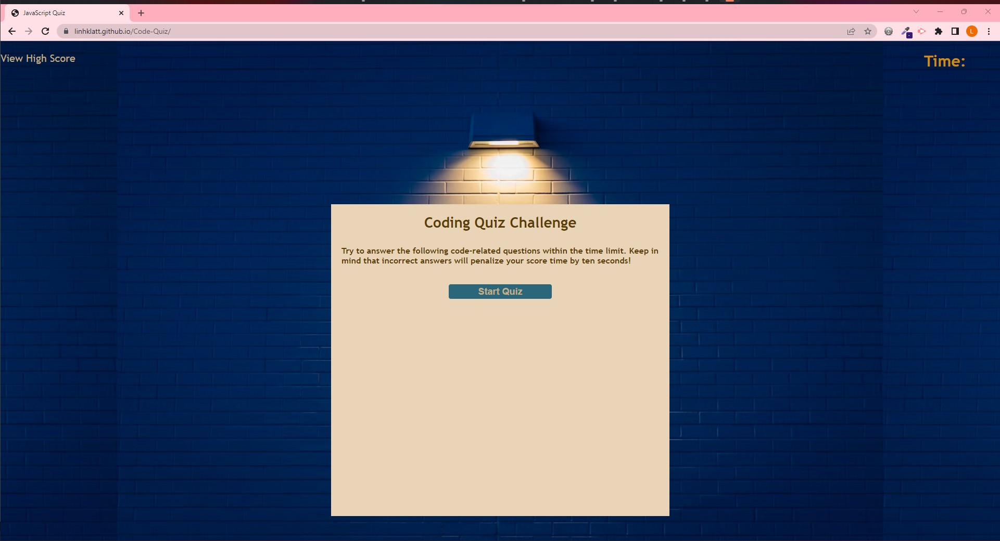
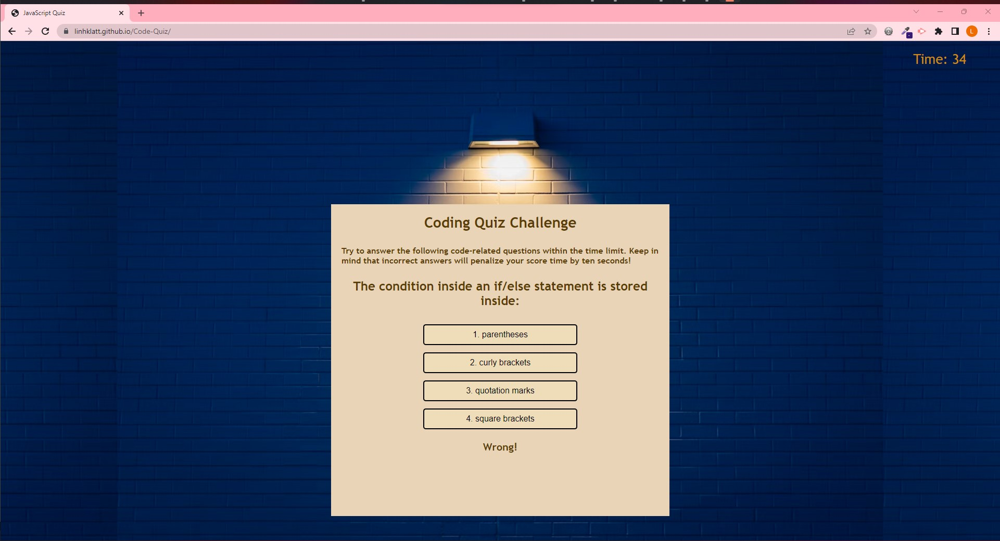
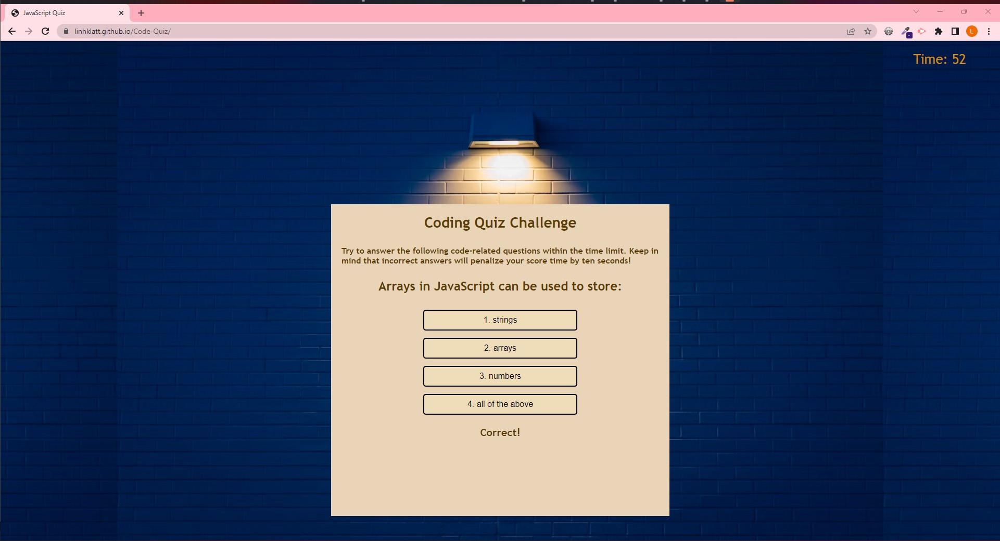
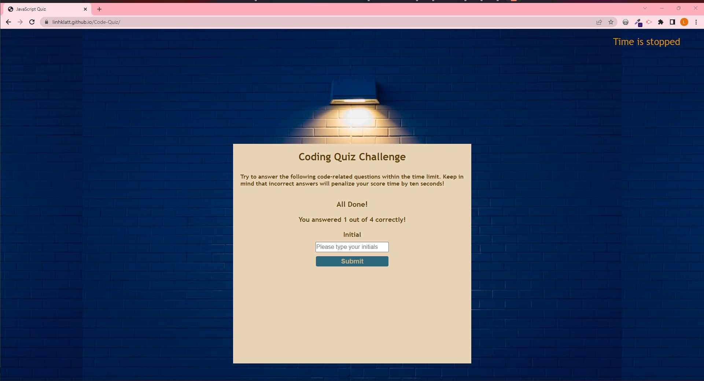
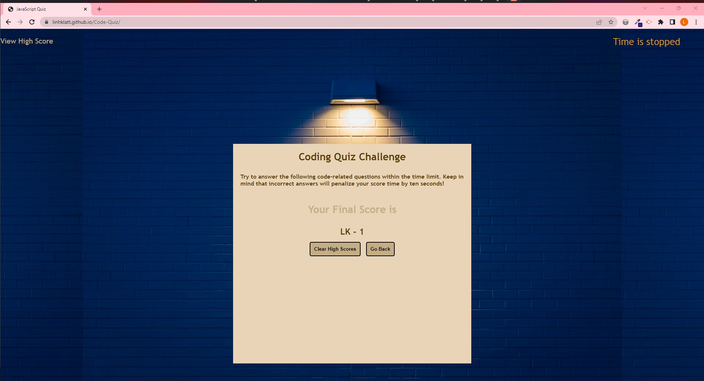

# Code-Quiz

## Description

This assignment is about Javascript Quiz with multiple choices! User has 4 questions to answer with a time limit of 75 seconds! When the user get the right/wrong answer they will jump to the next question but for the wrong answer, 10 seconds will be subtract from their current time.

When user finish their quiz, they will need to put their initial to view their high score and the user can go back to retake the quiz and clear the score as they wish.

The user also have a choice to review their high score by click on the View High Score section on the top left of the page. The timer will located on the top left of the page.

## Usage

1. Please click on this URL https://linhklatt.github.io/Code-Quiz to navigate to the quiz game.

2. The follow screenshots will explain the game

   
   This is the introduction and rule of the quiz

   
   When you click Start Quiz, the question with multi choices starts appear

   
   The user can see the result of their choice on the bottom. If the answer is right, the user will move to the next question. If the answer is wrong, the user's time will reduce 10 seconds

   
   This shows the user has chosen the correct answer

   
   This shows when the user finish their quiz and they need to submit their initial

   
   This shows the user final score.

## Credit

N/A

## License

Please refer to the license in the repo.
